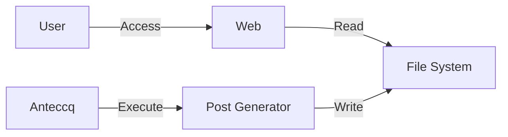

ブログの読み出し部分を変えました。
Tech

結構大きく変えました。というか今までイミフな感じだったのをそこはかとなく普通な風にした感じです。

## 何を変えたか
2世代変わっています。

### 1世代目
ソースコードに記事をハードコード的な感じで埋め込んでいました。

リポジトリ層の設計だけして、実際に DB から呼び出すとかだるいことは後から実装しようと考えた結果でした。

### 2世代目
今までは以下のような感じでした。

ブログに関連の様々な情報（タグ、タイトル、概要等）をどう付与するか悩んだ挙句、PostGenerator を作って MessagePack 形式にして置くという割と謎なことをしていました。

### 3世代目
2世代目ちゃんの管理が（2リポジトリにまたがっていたりして）超絶面倒 MAX だったので、記事自体もちゃんとリポジトリで管理しつつ、よしなにタグなどもろもろが適切に出せるように大きな変更を加えました。

実態はふつーに .md ファイルを読み込んで、内部にあるタイトル、タグ用のフィールドを読み、それ以外の文章をその場で HTML テキストへ変換、出力している感じです。

毎度毎度変換するのはアレなので、一回生成したものはキャッシュするようにしています。

今は2エントリしかないのでキャッシュ数の上限は設けていませんが、記事が増えてきたら LFU の仕組みでもよしなに作ろうかなと思います。

## そのほか
mermaid を使えるようにしたりしました。

ブログとしてはわりと良い見栄えをしたのではないでしょうか。かなり満足しています。

## これから
以前書いた通り、このブログは飽きるまでぽちぽち育成していきます。

次は GitHub Actions で遊んだ結果でも書こうと思います。